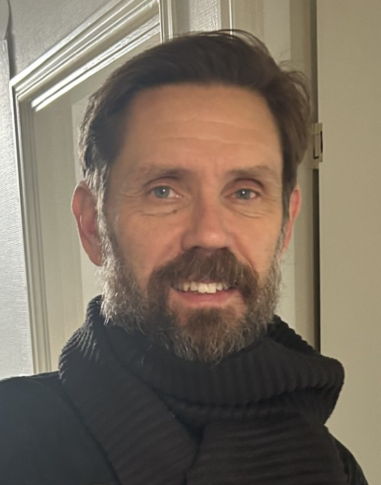
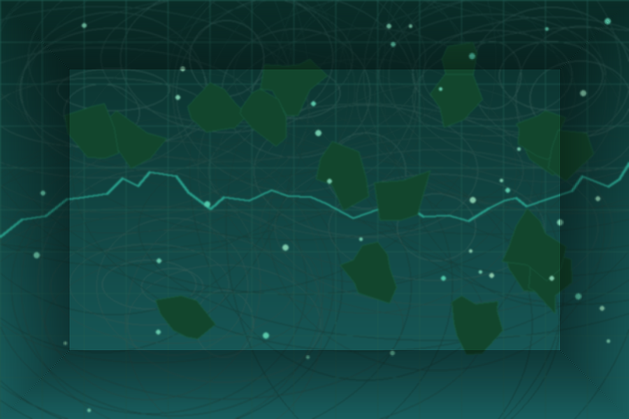

  
  <h1>Johan Karlsson</h1>
  
<strong>GIS-specialist &amp; Earth Observation Analyst</strong>

  
<em>Carbon MRV · Forest Monitoring · Biodiversity · Spatial Data Science</em>

---

## About Me

I am a GIS specialist and Earth Observation analyst with a background in biology and primate conservation. My work sits at the intersection of remote sensing, spatial data science, and environmental decision-making — primarily in carbon certification, forest change monitoring, and biodiversity assessment.

I work with Google Earth Engine, QGIS, Python, and PostgreSQL/PostGIS to build reproducible analysis pipelines, land cover change maps, and MRV workflows for carbon standards including Gold Standard, VCS/VM0047, and Plan Vivo. I am the founder of [Komba GIS AB](https://komba-gis.se), a GIS consultancy focused on nature, forestry, and climate applications.

I am currently seeking new assignments in GIS analysis, Earth Observation, and carbon/nature-based solutions — based in Djursholm (Stockholm), Sweden with remote and field flexibility.

  

---

[View My Projects :material-arrow-right:](projects/index.md){ .md-button .md-button--primary }
[Download CV :material-download:](assets/Johan_Karlsson_CV.pdf){ .md-button }

---

## Highlights

- **Carbon & MRV**: Gold Standard (GS4GG), VCS/VM0047 and Plan Vivo workflows, from data sourcing to maps and reporting.
- **Forest & mangrove monitoring**: change detection and time-series analysis (Sentinel-2, Landsat, Hansen GFC, GMW).
- **Biodiversity & NRM**: hotspot mapping and SDM workflows combining remote sensing and field/occurrence data.
- **Reproducible delivery**: documented pipelines using Python/SQL, QGIS QA, and Git/GitHub for traceability.

---

## Featured Projects

-   :material-sprout:{ .lg .middle } **[Gold Standard MRV Pipeline](projects/carbon-mrv/gold-standard.md)**

    Prototype MRV pipeline for A/R projects integrating field data, land cover analysis and automated reporting.

    [Open project →](projects/carbon-mrv/gold-standard.md){ .md-button .md-button--primary }

-   :material-chart-areaspline:{ .lg .middle } **[VM0047 Performance Benchmark](projects/carbon-mrv/vm0047-pb.md)**

    Reusable toolkit for VM0047 Performance Benchmark analysis applicable to any project area worldwide.

    [Open project →](projects/carbon-mrv/vm0047-pb.md){ .md-button .md-button--primary }

-   :material-forest:{ .lg .middle } **[Tiko Mangrove Threat Mapping](projects/forest-change/tiko-mangrove.md)**

    Year-by-year mangrove loss analysis combining Hansen GFC with Global Mangrove Watch extent.

    [Open project →](projects/forest-change/tiko-mangrove.md){ .md-button .md-button--primary }

---

## What I Can Help With

-   :material-map:{ .lg .middle } **Remote sensing & land cover change**

    Scoping, dataset selection, classification/change workflows, and map-ready outputs.

-   :material-file-document-outline:{ .lg .middle } **MRV support & documentation**

    Traceable methods, QA/QC, and reproducible workflows aligned with carbon standards.

-   :material-database:{ .lg .middle } **Geodata pipelines & automation**

    Python + PostGIS pipelines, processing at scale, and delivery formats (COG, STAC, GeoParquet).

---

## Skills

-   :material-layers:{ .lg .middle } **GIS & Remote Sensing**

    ---

    - QGIS (advanced), ArcGIS Pro, ArcGIS Online
    - Google Earth Engine — time series & land cover change
    - GDAL / OGR, GRASS GIS
    - Sentinel-2, Landsat, Planet imagery analysis

-   :material-code-braces:{ .lg .middle } **Programming & Automation**

    ---

    - Python — GeoPandas, Rasterio, NumPy, Pandas
    - R — sf, terra, ggplot2, biomod2
    - SQL — PostgreSQL + PostGIS
    - FME Form (in progress), GitHub Actions CI/CD

-   :material-leaf:{ .lg .middle } **Carbon & MRV**

    ---

    - Gold Standard (GS4GG), VCS / VM0047, Plan Vivo
    - Afforestation / Reforestation MRV workflows
    - Performance Benchmark analysis
    - Soil carbon modeling (MODIS, SoilGrids, GRIDMET)

-   :material-forest:{ .lg .middle } **Forest & Land Cover Change**

    ---

    - Hansen Global Forest Change (GFC)
    - CCDC change detection & classification
    - Global Mangrove Watch (GMW v3)
    - ESA WorldCover, ESRI LULC, NMD (Sweden)

-   :material-database:{ .lg .middle } **Data & Infrastructure**

    ---

    - PostgreSQL + PostGIS
    - Cloud-native geospatial (COG, STAC, GeoParquet)
    - Mergin Maps field data collection & QA/QC
    - Reproducible pipelines with Git & GitHub Actions

-   :material-paw:{ .lg .middle } **Biodiversity & NRM**

    ---

    - Species Distribution Modeling (MaxEnt / biomod2)
    - AlphaEarth satellite embeddings
    - Naturvärdesinventering (NVI) methodology
    - Habitat mapping and fragmentation analysis

---

## Connect

[GitHub](https://github.com/ulfboge){ .md-button }
[LinkedIn](https://linkedin.com/in/kombagis){ .md-button }
[Komba GIS AB](https://komba-gis.se){ .md-button }
