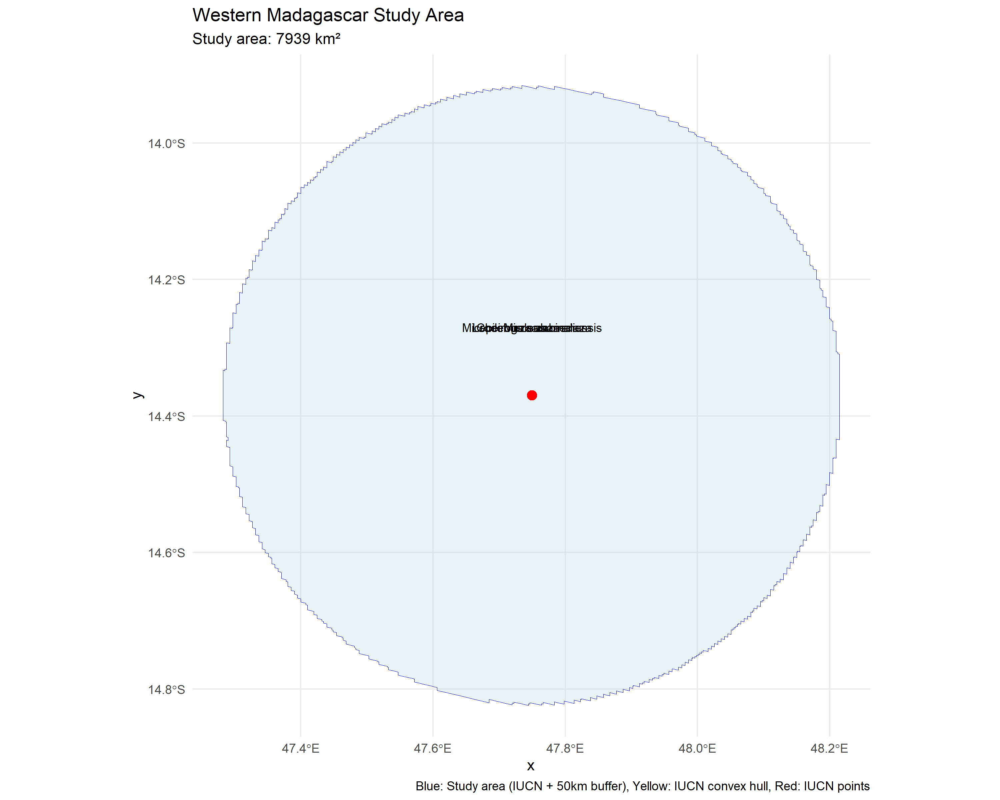
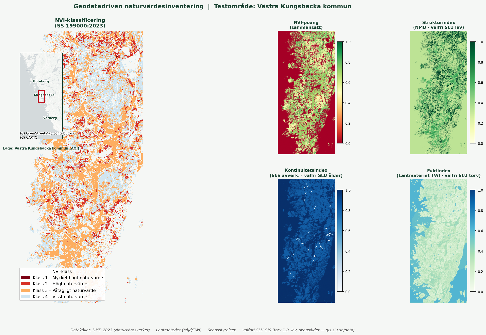
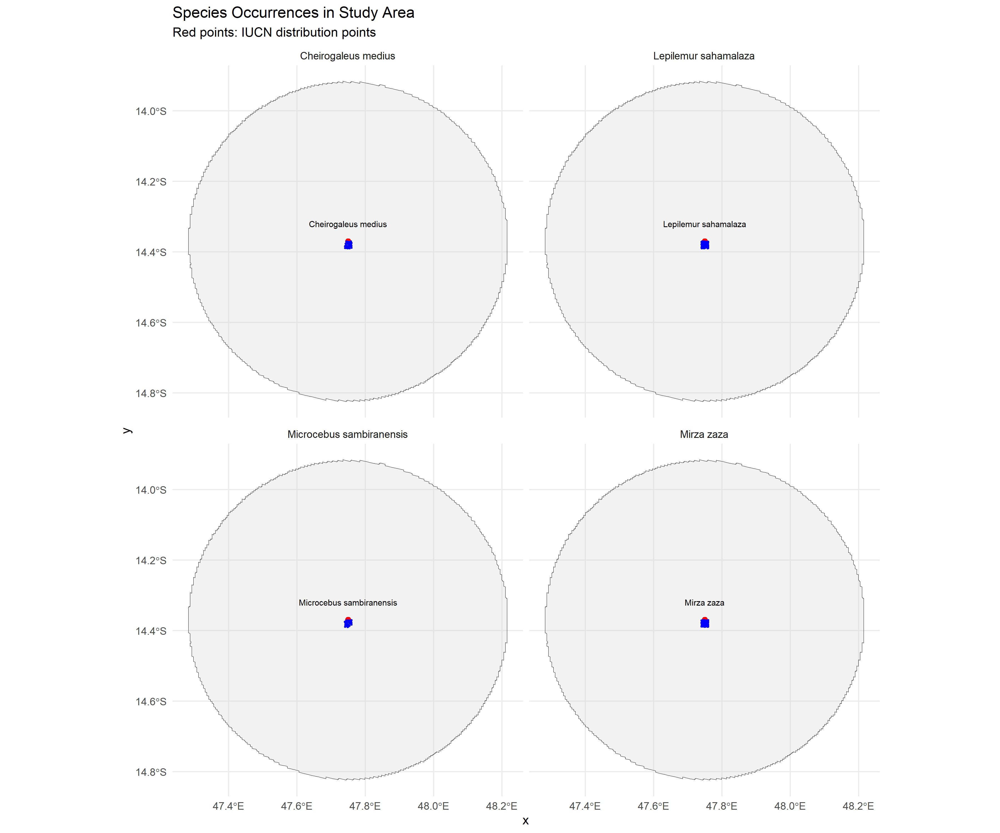

# Biodiversity & NRM

Projects in species distribution modeling, nature value assessment, and biodiversity data visualization.

**[Madagascar Lemur SDM](madagascar-lemur-sdm.md)**

Species Distribution Modeling for five lemur species using AlphaEarth embeddings and bioclimatic variables.

`R` `Python` `biomod2` `AlphaEarth`

[View Project →](madagascar-lemur-sdm.md){ .md-button }

**[NVI – Naturvärdesinventering](nvi.md)**

Reproducible pipeline for prioritized nature value hotspot mapping using Swedish open geodata.

`Python` `QGIS` `PostGIS` `NMD`

[View Project →](nvi.md){ .md-button }

**[Maps Portfolio](maps-portfolio.md)**

Biodiversity maps for galagos in Tanzania and lemurs in Madagascar.

`QGIS` `Leaflet` `GBIF`

[View Project →](maps-portfolio.md){ .md-button }

