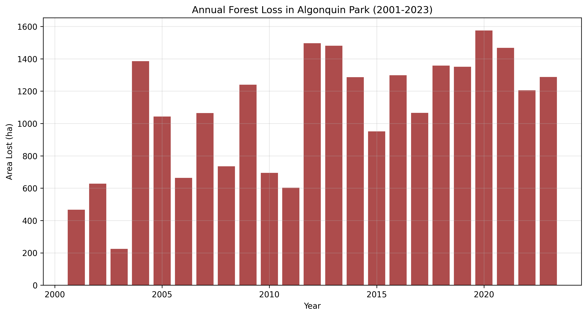
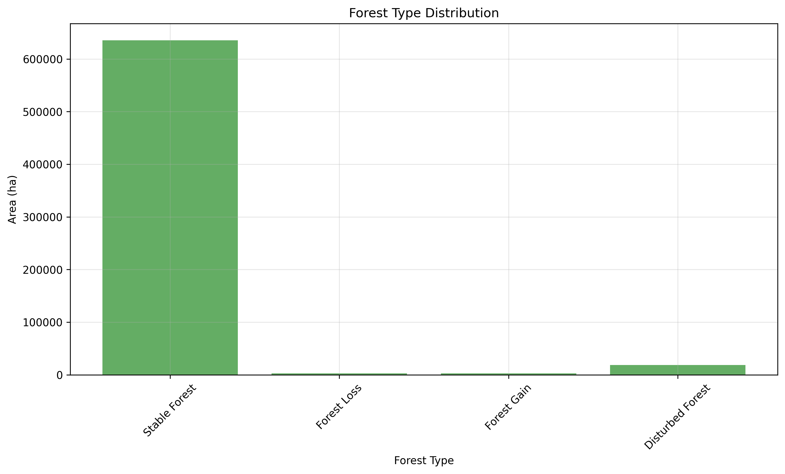
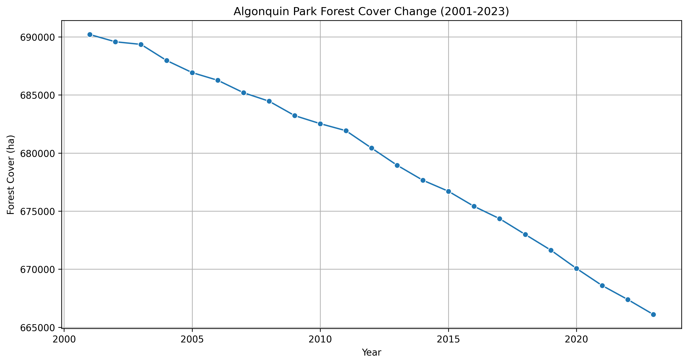

# Carbon & MRV

Projects focused on carbon verification, Measurement–Reporting–Verification (MRV) workflows, and nature-based solutions under international carbon standards.

**[Gold Standard MRV Pipeline](gold-standard.md)**

Field data pipeline and MRV validation for Afforestation/Reforestation projects under the Gold Standard for the Global Goals (GS4GG).

`Python` `QGIS` `Gold Standard`

[View Project →](gold-standard.md){ .md-button }

**[VM0047 Performance Benchmark](vm0047-pb.md)**

Reusable toolkit for Performance Benchmark analysis under the VM0047 methodology, applicable to any project area worldwide.

`Python` `GEE` `VCS` `VM0047`

[View Project →](vm0047-pb.md){ .md-button }

**[Soil Carbon Modeling](soil-carbon.md)**

Automated geospatial data extraction and processing for soil carbon modeling using Google Earth Engine.

`Python` `GEE` `SoilGrids`

[View Project →](soil-carbon.md){ .md-button }

**[Wildlands League – Ecosystem Services](wildlands-league.md)**

Carbon assessment and geospatial baseline for transitioning from conventional logging to ecosystem services.

`Python` `GEE` `QGIS`

[View Project →](wildlands-league.md){ .md-button }

