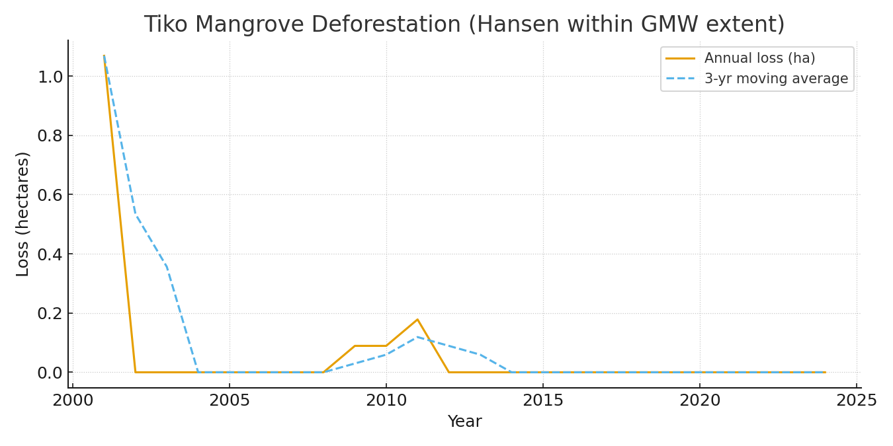
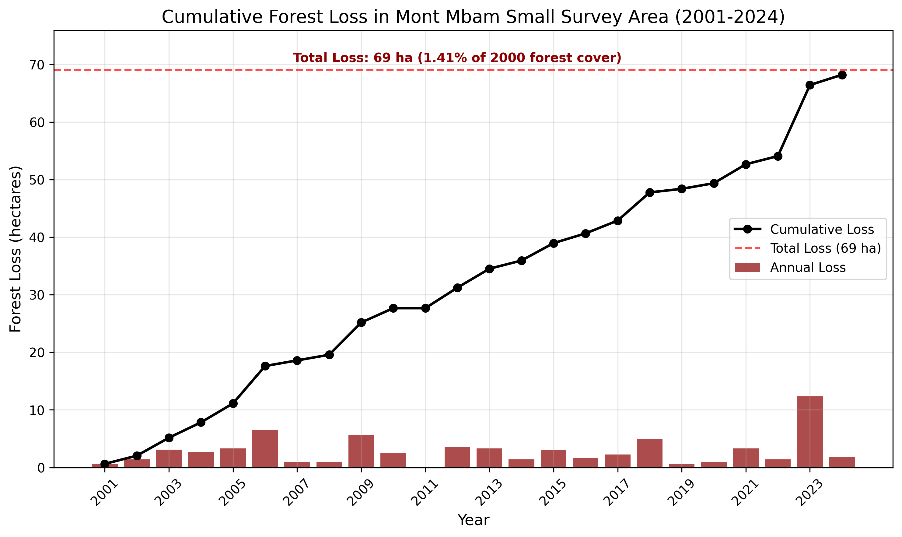
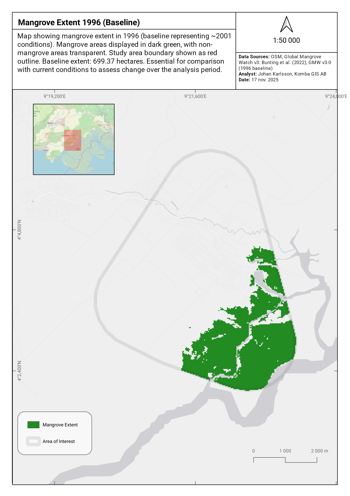
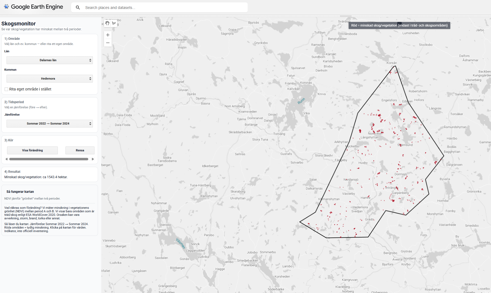
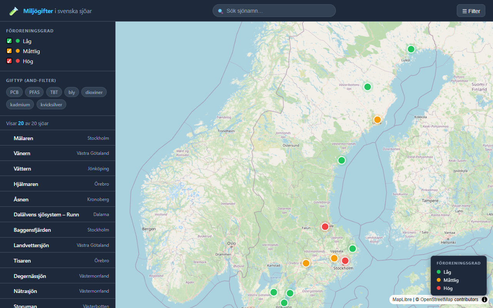
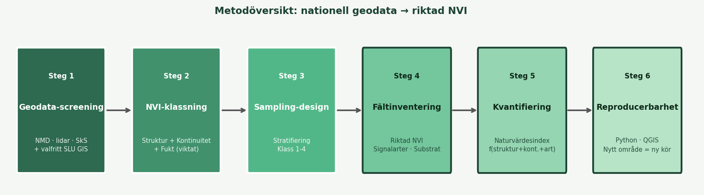
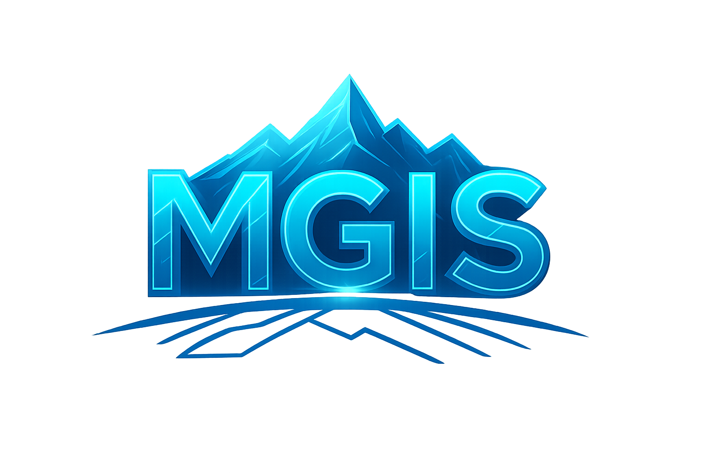
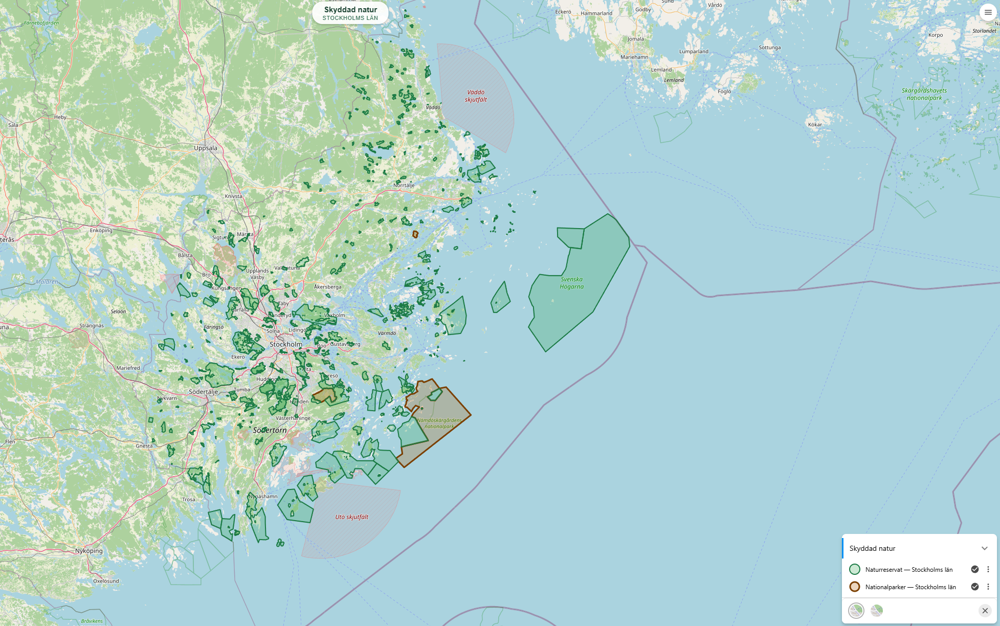

# Projects

A selection of my geospatial and earth observation projects. Click any card to see the full write-up.

---

## Browse by theme

[Carbon & MRV](carbon-mrv/index.md){ .md-button .md-button--primary }
[Forest & Mangrove Change](forest-change/index.md){ .md-button .md-button--primary }
[Biodiversity & NRM](biodiversity/index.md){ .md-button .md-button--primary }
[Web Apps & Data Pipelines](web-apps/index.md){ .md-button .md-button--primary }

---

## Carbon & MRV

**[Gold Standard MRV Pipeline](carbon-mrv/gold-standard.md)**

A prototype MRV pipeline for Afforestation/Reforestation projects under the Gold Standard for the Global Goals (GS4GG), integrating field data from Mergin Maps with land cover analysis and automated reporting.

`Python` `QGIS` `Gold Standard` `Mergin Maps`

[View Project →](carbon-mrv/gold-standard.md){ .md-button }

**[VM0047 Performance Benchmark](carbon-mrv/vm0047-pb.md)**

A reusable toolkit for conducting Performance Benchmark analysis under the VM0047 methodology for carbon credit projects, applicable to any project area worldwide.

`Python` `GEE` `VCS` `VM0047`

[View Project →](carbon-mrv/vm0047-pb.md){ .md-button }

**[Soil Carbon Modeling](carbon-mrv/soil-carbon.md)**

Automated extraction and processing of geospatial data for soil carbon modeling using Google Earth Engine, integrating GRIDMET, SoilGrids, MODIS, and other datasets for any Area of Interest.

`Python` `GEE` `SoilGrids` `MODIS`

[View Project →](carbon-mrv/soil-carbon.md){ .md-button }

**[Wildlands League – Ecosystem Services](carbon-mrv/wildlands-league.md)**

Geospatial analysis and carbon assessment for a transition from conventional logging to carbon credit development, including deforestation history, spatial baseline, and carbon standard selection.

`Python` `GEE` `QGIS` `Carbon Standards`

[View Project →](carbon-mrv/wildlands-league.md){ .md-button }

---

## Forest & Mangrove Change

**[CO2 Operate Cameroon Highlands](forest-change/co2-operate-cameroon.md)**

Remote sensing component for a Plan Vivo carbon certification project in the Cameroon Highlands: deforestation history assessment (2001–present), forest/non-forest classification, and polygon review.

`GEE` `QGIS` `Plan Vivo` `Landsat`

[View Project →](forest-change/co2-operate-cameroon.md){ .md-button }

**[Tiko Mangrove Threat Mapping](forest-change/tiko-mangrove.md)**

Mapping and quantifying mangrove deforestation in the Tiko area of Cameroon using Hansen GFC constrained to Global Mangrove Watch v3 extent, with yearly loss analysis and printable maps.

`GEE` `Python` `QGIS` `Hansen GFC` `GMW v3`

[View Project →](forest-change/tiko-mangrove.md){ .md-button }

**[VoNat Mont Mbam](forest-change/vonat-mont-mbam.md)**

Comprehensive land cover change analysis in the Mont Mbam region using CCDC and Hansen GFC, covering 1987–2024 forest loss patterns, fire disturbance, and landscape dynamics.

`GEE` `QGIS` `CCDC` `Hansen GFC`

[View Project →](forest-change/vonat-mont-mbam.md){ .md-button }

**[VoNat Tiko Mangroves](forest-change/vonat-tiko-mangroves.md)**

Remote sensing analysis of the Tiko Mangrove ecosystem in Cameroon using satellite imagery and machine learning to assess degradation, identify threats, and support conservation planning.

`GEE` `Python` `QGIS` `Mangrove`

[View Project →](forest-change/vonat-tiko-mangroves.md){ .md-button }

**[Skogsmonitor GEE Demo](forest-change/skogsmonitor.md)**

A Google Earth Engine App demonstrating satellite-based forest change monitoring in Sweden for environmental NGOs, using Sentinel-2 NDVI change detection with an interactive UI.

`GEE` `JavaScript` `Sentinel-2` `NDVI`

[View Project →](forest-change/skogsmonitor.md){ .md-button }

---

## Biodiversity & NRM

**[Madagascar Lemur SDM](biodiversity/madagascar-lemur-sdm.md)**

Species Distribution Modeling for five lemur species in Madagascar using AlphaEarth satellite embeddings, SRTM, and WorldClim bioclimatic variables, with LASSO regularization and Random Forest.

`R` `Python` `biomod2` `AlphaEarth`

[View Project →](biodiversity/madagascar-lemur-sdm.md){ .md-button }

**[NVI – Naturvärdesinventering](biodiversity/nvi.md)**

A reproducible pipeline combining Swedish open geodata (NMD, Lantmäteriet, Skogsstyrelsen) into a prioritized hotspot map for field NVI surveys, published on GitHub Pages.

`Python` `QGIS` `PostGIS` `NMD`

[View Project →](biodiversity/nvi.md){ .md-button }

**[Maps Portfolio](biodiversity/maps-portfolio.md)**

A collection of biodiversity maps visualizing species distribution data for galagos in Tanzania and lemurs in Madagascar, created in QGIS and published as interactive web maps.

`QGIS` `Leaflet` `GBIF`

[View Project →](biodiversity/maps-portfolio.md){ .md-button }

---

## Web Apps & Data Pipelines

**[Miljögifter i svenska sjöar](web-apps/miljogifter.md)**

An interactive web map visualizing environmental toxins (PFAS, mercury, PCB, cadmium) in Swedish lakes, with clickable markers, color-coded contamination levels, and substance filtering.

`JavaScript` `Leaflet` `HTML/CSS`

[View Project →](web-apps/miljogifter.md){ .md-button }

**[Geodata Pipeline Demo](web-apps/geodata-pipeline.md)**

An automated geodata workflow built with Python and GitHub Actions: reads GeoPackage data, calculates areas, filters by minimum area threshold, and logs each run.

`Python` `GeoPandas` `GitHub Actions`

[View Project →](web-apps/geodata-pipeline.md){ .md-button }

**[MGIS-Downloader](web-apps/mgis-downloader.md)**

A web application for downloading and processing geographic data from Swedish authorities, simplifying access to open geodata sources.

`JavaScript` `Web App` `Swedish Geodata`

[View Project →](web-apps/mgis-downloader.md){ .md-button }

**[Naturkarta – Skyddad natur och skog](web-apps/naturkarta.md)**

Web GIS portal built on Origo Map displaying Swedish nature reserves, national parks, Natura 2000, and logging notifications with clickable popups.

`Origo Map` `OpenLayers` `WMS` `GeoJSON`

[View Project →](web-apps/naturkarta.md){ .md-button }

