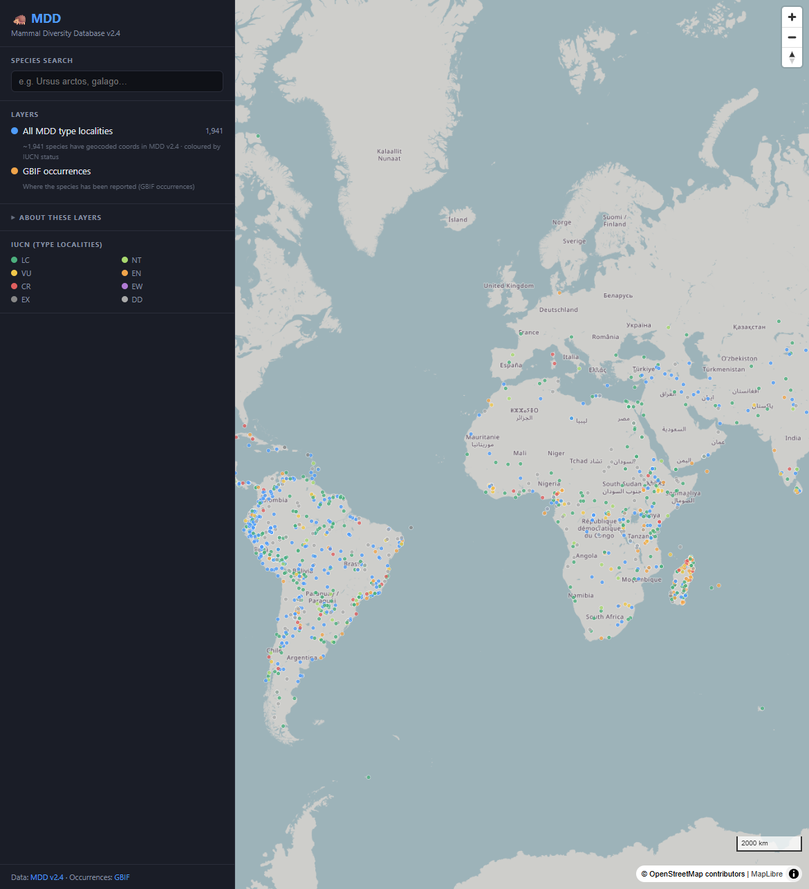

# Web Apps & Data Pipelines

Projects combining web development, data visualization, and automated geodata workflows.

**[Miljögifter i svenska sjöar](miljogifter.md)**

Interactive Leaflet web map visualizing PFAS, mercury, PCB, and cadmium in Swedish lakes.

`JavaScript` `Leaflet` `HTML/CSS`

[View Project →](miljogifter.md){ .md-button }

**[Geodata Pipeline Demo](geodata-pipeline.md)**

Automated Python + GitHub Actions pipeline: reads GeoPackage, calculates areas, filters, and logs.

`Python` `GeoPandas` `GitHub Actions`

[View Project →](geodata-pipeline.md){ .md-button }

**[MGIS-Downloader](mgis-downloader.md)**

Web application for downloading and processing geographic data from Swedish authorities.

`JavaScript` `Web App`

[View Project →](mgis-downloader.md){ .md-button }

**[Naturkarta — Skyddad natur och skog](naturkarta.md)**

Web GIS portal built on Origo Map displaying Swedish nature reserves, national parks, Natura 2000, and logging notifications with clickable popups.

`Origo Map` `OpenLayers` `WMS` `GeoJSON`

[View Project →](naturkarta.md){ .md-button }

**[Mammal Diversity Database (MDD)](mdd.md)**

Interactive MapLibre web map and FastAPI over MDD v2.4 — 6,871 mammal species, type localities by IUCN status, and GBIF occurrence overlays.

`DuckDB` `FastAPI` `MapLibre` `React` `Docker`

[View Project →](mdd.md){ .md-button }

